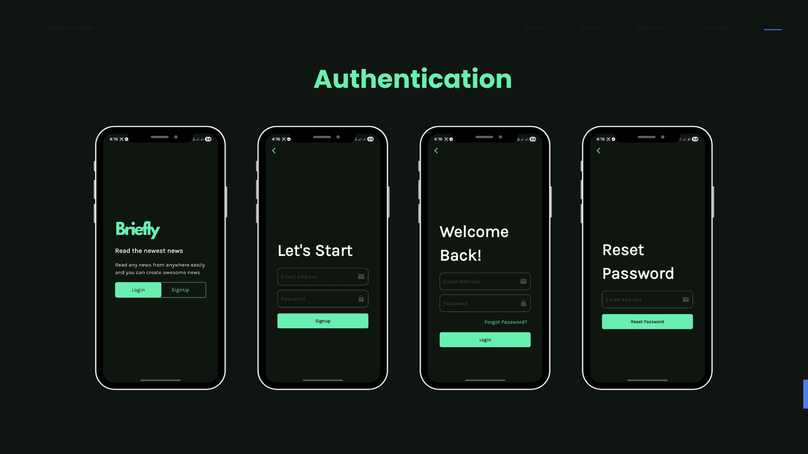
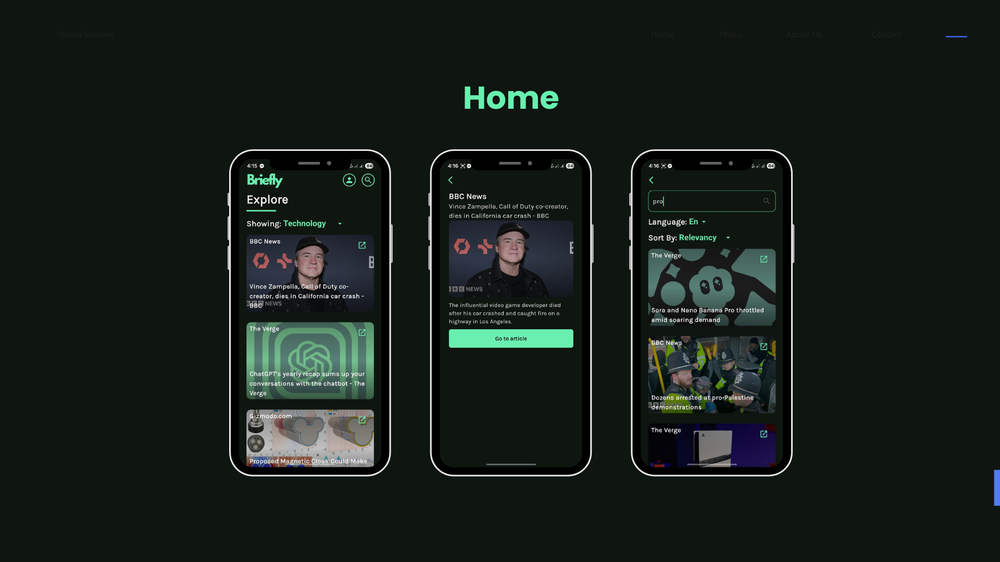

Briefly is a cross-platform news application built with Flutter. It allows users to browse, search, and read the latest news articles from around the world, powered by the NewsAPI. The app features user authentication through Firebase, a clean, dark-themed user interface, and efficient state management.

## Screenshots

### Authentication


### Home


## Features

- **Firebase Authentication:** Secure user sign-up, login, and password reset functionality.
- **Top Headlines:** Browse the latest news, filterable by categories such as Business, Technology, Sports, and Health.
- **Infinite Scrolling:** Seamlessly load more articles as you scroll.
- **Advanced Search:** Find specific articles with filters for language and sorting criteria (e.g., relevancy, popularity).
- **Article Details:** View detailed information for each article, including the source, author, and description.
- **External Linking:** Open the original article URL in an external browser.
- **User Profile:** A simple profile screen displaying the user's email and a logout option.

## Tech Stack & Architecture

- **Framework:** Flutter
- **Architecture:** Clean Architecture with a feature-first directory structure.
- **State Management:** `flutter_bloc` for predictable and scalable state handling.
- **Routing:** `go_router` for a declarative, URL-based navigation system.
- **Backend & Authentication:** Firebase Authentication
- **Data Source:** [NewsAPI](https://newsapi.org/)
- **Networking:** `dio` for making HTTP requests.
- **Dependency Injection:** `get_it` service locator for decoupling dependencies.
- **Environment Management:** `flutter_dotenv` to securely manage API keys.

## Getting Started

To get a local copy up and running, follow these simple steps.

### Prerequisites

- Flutter SDK installed.
- An IDE such as VS Code or Android Studio.

### Configuration

1.  **Clone the repository:**
    ```sh
    git clone https://github.com/AbdElrhmanRezq/eyego_task.git
    cd eyego_task
    ```

2.  **Set up Firebase:**
    This project uses Firebase for authentication.
    - Create a new project on the [Firebase Console](https://console.firebase.google.com/).
    - Add Android and/or iOS applications to your Firebase project.
    - Configure your local project by running the FlutterFire CLI:
      ```sh
      flutterfire configure
      ```
    - This will automatically generate `lib/firebase_options.dart` and place the respective configuration files (`google-services.json` and `GoogleService-Info.plist`) in your project.

3.  **Set up NewsAPI:**
    The app fetches news from the NewsAPI.
    - Go to [newsapi.org](https://newsapi.org/) and get a free API key.
    - Create a file named `.env` in the root directory of the project.
    - Add your API key to the `.env` file as follows:
      ```env
      API_KEY='YOUR_NEWS_API_KEY'
      ```

### Installation & Execution

1.  **Install dependencies:**
    ```sh
    flutter pub get
    ```

2.  **Run the application:**
    ```sh
    flutter run
    ```

## Project Structure

The project follows a feature-driven, clean architecture to ensure scalability and maintainability.

```
lib/
├── core/               # Shared utilities, widgets, error handling, and services.
│   ├── errors/
│   ├── utils/
│   └── widgets/
├── features/           # Feature-based modules.
│   ├── auth/           # Authentication feature (login, signup, reset).
│   │   ├── data/       # Repositories and data sources.
│   │   └── presentation/ # UI (screens, widgets) and state (Cubits).
│   ├── home/           # News browsing and searching feature.
│   └── splash/         # Splash screen logic and UI.
├── main.dart           # App entry point and theme configuration.
└── consts.dart         # Global constants like app colors.
